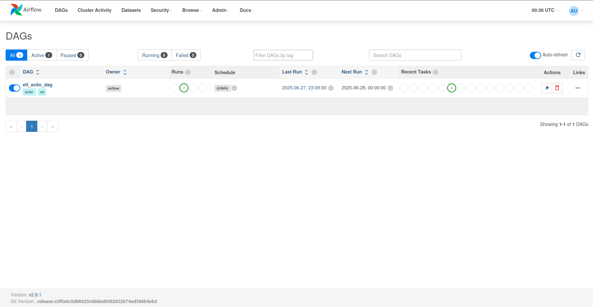
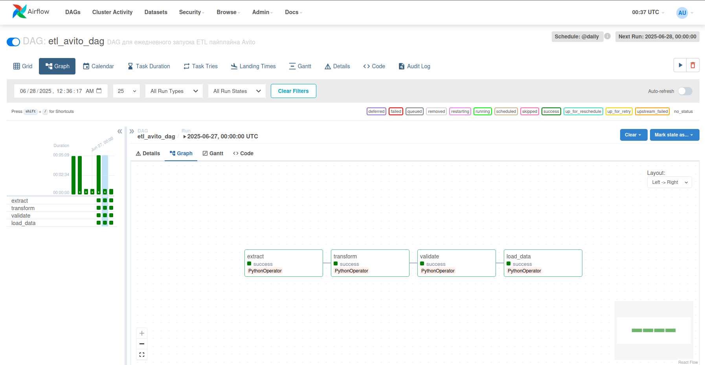
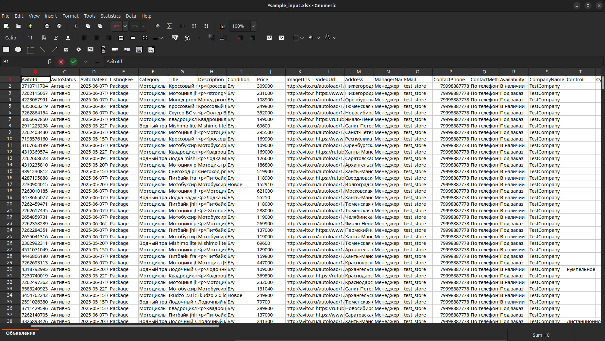

# ETL-пайплайн для работы с объявлениями Авито через автозагрузку


## Описание проекта

Проект реализует полноценный ETL-процесс (`Extract` → `Transform` → `Validate` → `Load`) для обработки данных автозагрузки объявлений на платформе Авито.

Входные данные: по умолчанию обрабатывается тестовый файл `.xlsx` Также поддерживаются `.xls`, `.csv`.

Используется в ежедневной работе компании, занимающейся продажей техники на Авито.

Объем: обработка около 20 файлов, каждый объёмом ~50 000 строк.

---

### Функциональность:

- Автоматическая очистка и нормализация данных.
- Проверка уникальности и целостности.
- Проверка соответствия требованиям тех. документации Авито с помощью справочника.
- Валидация дилерских ограничений по городам и брендам.
- Проверка и дублирование объявлений для размещения каждой единицы техники во всех филиалах дилера (если требуется).
- Логирование ключевых проблем для ручного анализа.
- Вывод аналитической информации для корректировки бизнес-стратегии.

---

### Цели, которые решает проект:

- Упростить, ускорить и стандартизировать процесс обработки данных.
- Повысить точность и эффективность размещения объявлений.
- Предоставить бизнесу данные для принятия решений по построению стратегии продаж.

---

## Стек

- Python 3.10+
- pandas
- Airflow
- openpyxl
- Docker
- requests
- aiohttp

---

<details>
<summary><strong>Структура проекта (нажать для открытия)</strong></summary>

```bash
etl_avito/
│
├── dags/                         
│   └── etl_avito_dag.py          # DAG для Airflow: описание этапов ETL-процесса и порядок их выполнения
│
├── etl/                          
│   ├── __init__.py               # делает директорию etl Python-пакетом
│   ├── config.py                 # загрузка конфигураций, переменных окружения
│   ├── extract.py                # логика извлечения данных из исходных файлов
│   ├── load.py                   # сохранение обработанных данных в файл или БД
│   ├── pipeline_config.yaml      # YAML-конфигурация пайплайна (список трансформаций и настройки)
│   ├── transform.py              # функции очистки, нормализации и трансформации данных
│   ├── utils.py                  # вспомогательные утилиты и функции
│   ├── validation.py             # валидация данных (проверки целостности, формата и справочников)
│   └── data/                     
│       ├── __init__.py           # делает директорию data Python-пакетом
│       ├── avito_data.parquet    # промежуточный parquet-файл с данными после извлечения или трансформации
│       ├── input_data.md         # описание или пример структуры исходных данных
│       ├── input_sample.xlsx     # тестовый Excel-файл с объявлениями (используется для проверки пайплайна)
│       └── reference_data.py     # справочники городов, брендов и других констант
│
├── .env                          # основной файл переменных окружения (не хранится в репозитории)
├── .env.example                  # пример .env с переменными окружения для локальной разработки
├── .flake8                       # конфигурация линтера Flake8
├── .gitignore                    # список файлов и папок, игнорируемых Git
├── .pre-commit-config.yaml       # конфигурация хуков pre-commit
├── docker-compose.yaml           # описание сервисов для запуска проекта через Docker Compose
├── Dockerfile                    # сборка собственного образа Airflow для проекта
├── mypy.ini                      # настройки статической типизации (mypy)
├── pyproject.toml                # единый конфигурационный файл для сборщиков и линтеров (например, Black, isort)
├── README.md                     # описание проекта, установка, запуск и документация
├── requirements.txt              # список зависимостей для работы проекта
└── requirements-dev.txt          # список зависимостей для разработки (тесты, линтеры, mypy и др.)

```
</details> 


## Этапы обработки

### 1. Extract

Чтение файла-таблицы с объявлениями

### 2. Transform

- удаление мусорных/пустых строк
- проверка на уникальность значений столбцов AvitoId и Id
- удаление строк, нарушающих дилерство по брендам и городам
- проверка размещения по всем городам согласно Title и Make
- нормализации (приведение к единым значениям)
- приведение типов данных колонок из справочника
- фильтрация и корректировка значений Address в соответствии со справочником городов
- нормализация строк, сгруппированных по Title
- нормализация адресов + удаление ненормализованных

Все действия логируются. Проблемные записи (дубликаты, неизвестные адреса, нарушения) сохраняются отдельно или выводятся в лог.


### 3. Validate

1. **Валидация значений колонок**  
   - Проверяется соответствие данных требованиям технической инструкции Авито автозагрузки.  
   - Используется специальный справочник (словарь), где для каждой колонки указаны:
     - допустимые значения,
     - обязательность заполнения,
     - формат данных (регулярные выражения),
     - допустимый тип данных.

2. **Валидация ссылок**  
   - Проверяется работоспособность ссылок в колонках `ImageURL`, `VideoURL` и `VideoFilesURL`.


### 4. Load

В зависимости от значения параметра `API_FLAG` (например, через переменную окружения):

✅ `API_FLAG` = `False` (по умолчанию)

Выполняется локальное сохранение обработанного DataFrame в файл (Excel или CSV), в том же формате, что исходный файл.

К имени файла добавляется временная метка.

✅ `API_FLAG` = `True`

Файл сохраняется локально.

Загружается на Яндекс.Диск с получением публичной ссылки.

Публичная ссылка указывается в профиле автозагрузки Авито (через Авито API).

Запускается процесс автозагрузки объявлений на платформе Авито (также через Авито API).

Итог: строки из обработанного файла создаются (или обновляются) как отдельные объявления на Авито.

## Логика дилерства

Справочник `dealerships` указывает, в каких городах разрешено размещение объявлений для каждого бренда. Все нарушения автоматически отсеиваются и логируются по AvitoID.

---

## Установка

### Установка зависимостей

Создайте виртуальное окружение и активируйте его:

```bash
python3 -m venv venv
source venv/bin/activate
```

### Настройка переменных окружения

Создайте файл `.env` на основе шаблона `.env.example`:

<details>
<summary>Образец .env-файла</summary>

```Python
### пути к входному и выходному Excel-файлу (внутри Docker-контейнера)
INPUT_PATH=/opt/airflow/etl/data/input_sample.xlsx
OUTPUT_PATH=/opt/airflow/etl/data/output.xlsx
PIPELINE_CONFIG=etl/pipeline_config.yaml

### флаг автозагрузки на Авито
API_FLAG=False

### данные аккаунта Авито
CLIENT_ID=stub
CLIENT_SECRET=stub
EMAIL=stub
USER_ID=stub

### токен Яндекс.Диска
YANDEX_TOKEN=stub
```

</details>

```bash
cp .env.example .env
```

Переменные также можно задать через Airflow Variables (раздел Admin → Variables в веб-интерфейсе Airflow).

### Входные данные

- По умолчанию обрабатывается тестовый файл:

```
etl_avito/data/sample.xlsx
```

- Чтобы использовать свой файл, задайте переменную окружения `INPUT_PATH`:

    - либо в `.env`
    - либо в Airflow Variables → INPUT_PATH

Файл должен быть расположен в папке:

```
etl_avito/data/
```

### Запуск проекта

Убедитесь, что скопирован файл `.env` и установлены все зависимости Docker или Docker Compose.

Соберите docker-образы (если не собраны ранее):

```bash
docker-compose build
```

Запустите Airflow:

```bash
docker-compose up -d
```

Airflow UI доступен по адресу:

[http://localhost:8080](http://localhost:8080)


По умолчанию:

- Username: admin
- Password: admin

Запустите DAG `etl_avito_dag`

<details>
<summary><strong>Скриншоты работы в Airflow</strong></summary>

<details>
<summary>Airflow DAG UI</summary>



</details>

<details>
<summary>Graph view</summary>



</details>

<details>
<summary>Образец входных данных</summary>



</details>

</details>

## Использование в Airflow

- DAG называется `etl_avito_dag`
- DAG можно запустить вручную через UI или командой:

```bash
docker-compose run webserver airflow dags trigger etl_avito_dag
```

## Производительность

Время обработки файла (~50 000 строк) — около 2 минут на машине с 4 CPU, 8 GB RAM.

## Тестирование

В планах добавить unit-тесты для основных функций трансформации и валидации данных.
